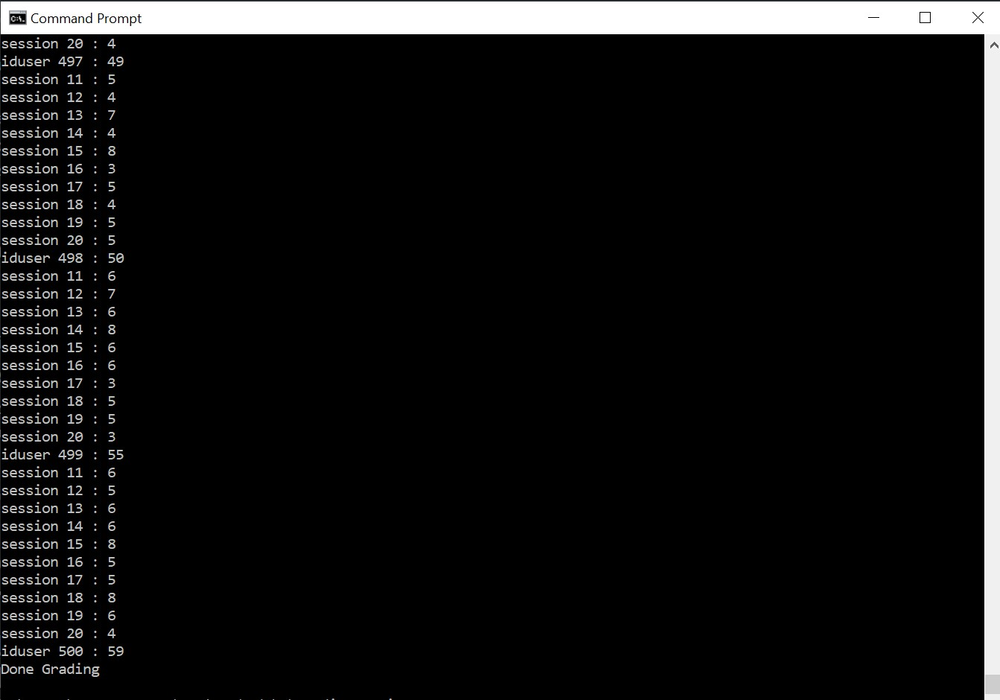
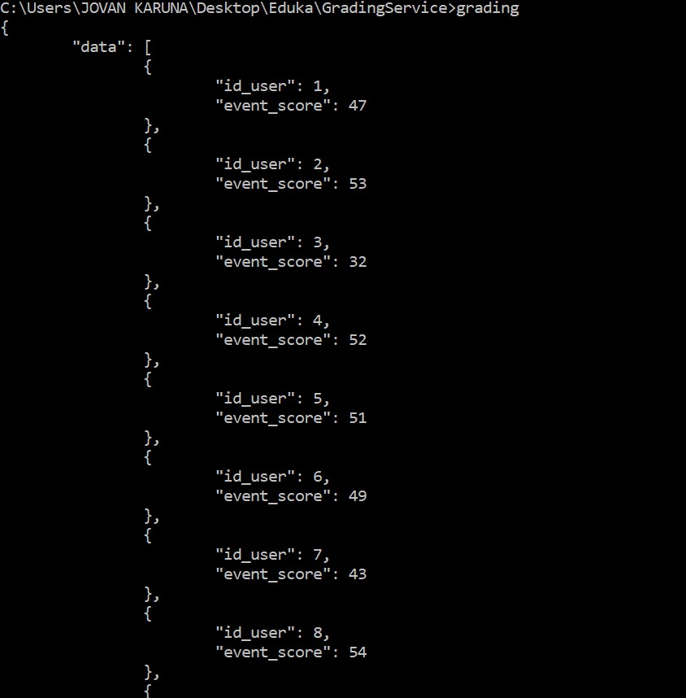
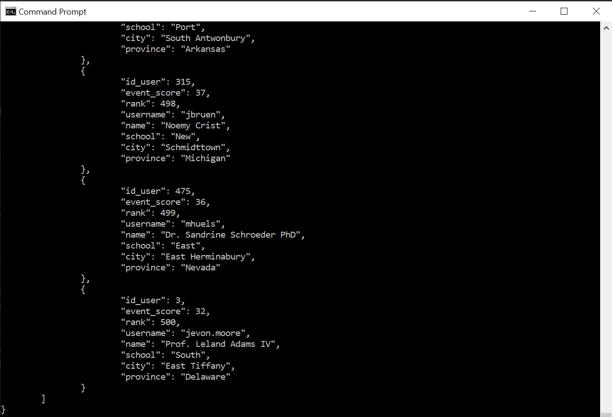
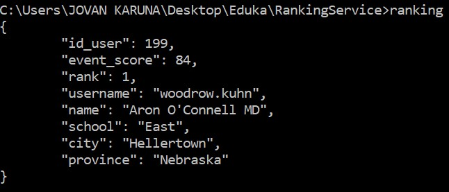
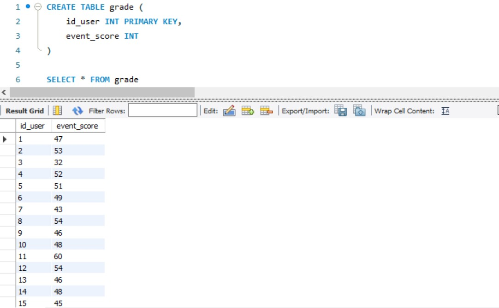

# API-GradingAndRankingService
This is a project is about making API for Grading Service and Ranking Service as an assignment for Eduka internship.
I Used golang for this project.

## Prerequisite
1. Go language
1. go-sql-driver/mysql (type `driver go get -u github.com/go-sql-driver/mysql` in terminal)

## Screenshots
Grading output

GetScore

Ranking output

FindRank first rank

Mysql grading database schema

## Compile and Run
### Grading Service
1. Make a local mysql database named grading with a table like the screenshots "Mysql grading database schema"
1. Check the code in grading.go and change the root and password in line 50 and 124 into your password
1. Open Command Prompt and go to directory code/GradingService
1. type `go build grading.go` to compile and build grading.go
1. type `grading`, in the main function the gradingService() will take examsheets.json and grade the score, 
then store it at grading database, while the getScore() will fetch the data at grading database and make an output as Json format
in terminal and also make a json file named score.json (you can change the name in line 148)

### Ranking Service
1. You need to run Grading Service because we need the mysql grading database data
1. Check the code in grading.go and change the root and password in line 70 and 105 into your password
1. Open Command Prompt and go to directory code/RankingService
1. type `go build ranking.go` to compile and build ranking.go
1. type `ranking`, in the main function the rankerService() will get all data from mysql grading database then ranks them with
score DESC and then output the data with completed user details gotten from User API given by eduka as Json Format in terminal
and make a json file named rank.json(you can change the name in line 101), while the findRank(rank) in line 134 take an integer input
that represents rank then find users who had that rank from mysql and make an output of completed user details and rank as Json format 
in the terminal 

## Acknowledgement
github : (https://github.com/JovanKaruna/API-GradingAndRankingService) Created By : Jovan Karuna Cahyadi 

